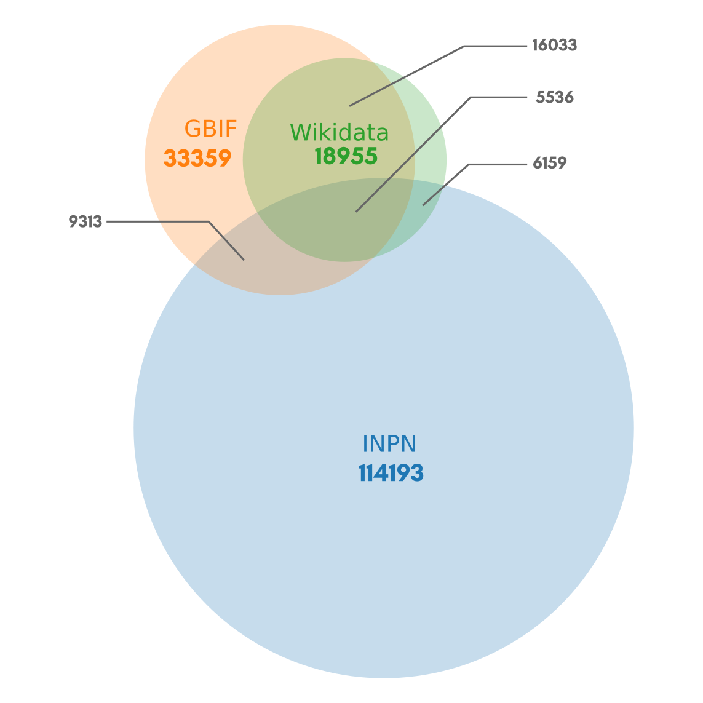

# Goal of this project
The aim of this repository is to propose an up-to-date correspondance between latin and vernacular french names for as many taxa as possible. This is used for the [french version of the Lifemap Explorer of the tree of Life](http://lifemap-fr.univ-lyon1.fr)

# Dataset produced
Using the three data sources listed below (GBIF, INPN and wikidata), we recover vernacular names for 140 538 distinct taxa. 


# Data sources and retrieval strategies

For now, three sources of data are used. Here is the Venn diagram representing the content of each data source (in terms of the number of taxa with vernacular names in French) and their overlap. 



> In total, we recover vernacular names for 140 538 distinct taxa. 


**1. Wikidata**


Wikidata is a great resource for species names translation. The following code (Sparkle) can be used to retrieve the common names of taxons in french, using the online service [https://query.wikidata.org](https://query.wikidata.org/).

```
SELECT DISTINCT ?sci ?comm WHERE {
  ?taxon wdt:P31 wd:Q16521;
    wdt:P225 ?sci;
    wdt:P1843 ?comm.
  FILTER(LANGMATCHES(LANG(?comm), "fr"))
  SERVICE wikibase:label { bd:serviceParam wikibase:language "fr". }
} 
```


The downloaded result (tsv format) is called `query.tsv`
> Vernacular names for 18 955 taxa (April 20th, 2020)

**2. GBIF**


GBIF contains vernacular names for many species in many languages. A single zip file can be downloaded here : 
http://rs.gbif.org/datasets/backbone/backbone-current.zip

The important files here are `VernacularName.tsv` and `Taxon.tsv`

> Vernacular names for 33 359 taxa (April 20th, 2020)


**3. INPN**


The INPN is a great resource for species names of species living in France (but not the others). The complete data can be downloaded from https://inpn.mnhn.fr/docs-web/docs/download/301786

The important file here is `TAXREFvXX.txt` where XX is the current version.

> Vernacular names for 114 193 taxa (April 20th, 2020; TAXREFv13)


